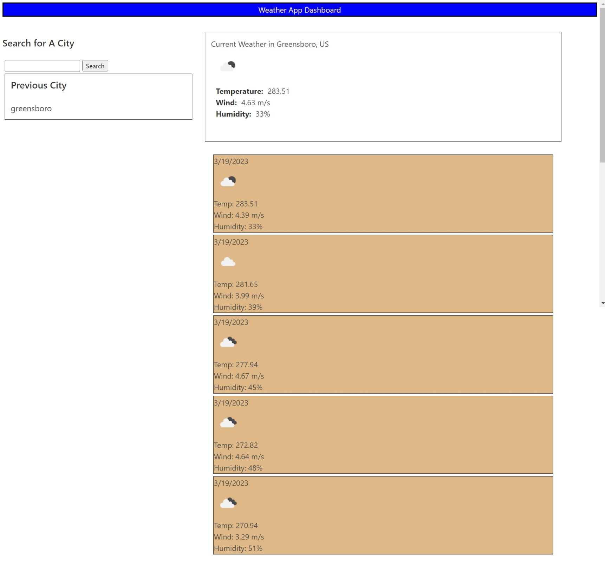

# 06 Server-Side APIs: Weather Dashboard

## Task

Created a weather app that displays the current weather for a searched city, using open Weather API, and displays the 5 day forecast for that particular city. 

## Mock-Up

The following image shows the web application's appearance and functionality:

# Links 
